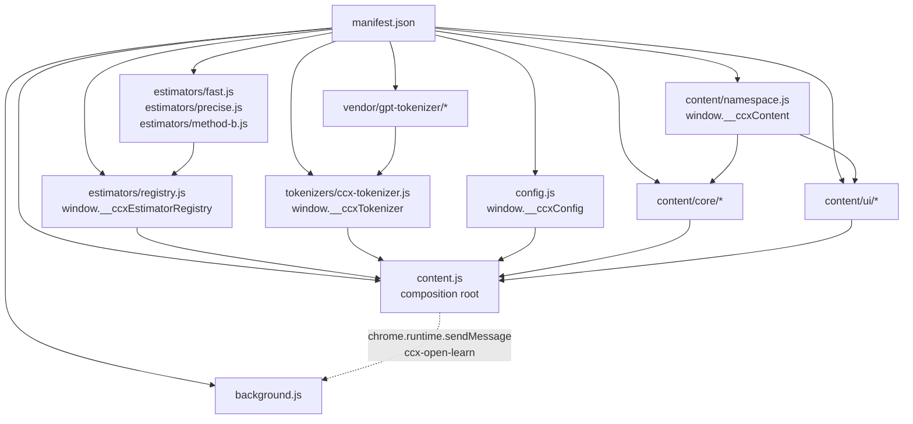

# ChatGPT Context Estimator

`ChatGPT Context Counter` is a Chrome/Chromium extension that estimates how much of the current ChatGPT conversation context is in use. It adds a small overlay on `chatgpt.com` with a percentage, token estimate, and a basic breakdown.

This project is currently preparing for a public beta release. The extension is useful today, but it is still best described as an estimate rather than an exact measurement.

## What Works Today

- Estimates token usage from the conversation text loaded in the page.
- Shows total estimated tokens, chat text tokens, overhead tokens, and percent used.
- Optional per-message token usage badges (tokens and context-window percent) in chat history.
- Supports two estimation methods:
  - `Fast`: character-based heuristic
  - `Precise`: bundled tokenizer-based estimate
- Lets you manually select your ChatGPT plan and model.
- Auto-refreshes estimates when ChatGPT page/tab navigation changes within the app.
- Warns when the visible history may be incomplete.
- Stores your selected settings locally in the browser.

## Current Limitations

- Attachments are **not implemented yet** and are not included in totals.
- Automatic model detection is **not implemented yet**; model selection is manual.
- Only regular chat pages are supported (`/` new chat and `/c/<conversation-id>`).
- ChatGPT Projects and other non-regular layouts are **not supported** and show `Unsupported` in the overlay.
- Estimates only use content currently present in the DOM, so unloaded or virtualized history can make totals low.
- Very large chats can cause `Precise` estimation to fall back to `Fast`.
- The extension is informational only and should not be treated as an exact tokenizer for ChatGPT web internals.

## Supported Browsers

- Chrome
- Chromium
- Edge
- Brave

Any Chromium-based browser that supports Manifest V3 extensions should work, but Chrome/Chromium-based desktop browsers are the intended target.

## Install

1. Open `chrome://extensions`.
2. Enable `Developer mode`.
3. Click `Load unpacked`.
4. Select this repository folder.
5. Open `https://chatgpt.com` and start or open a conversation.

## Usage

1. Open ChatGPT on `https://chatgpt.com`.
2. Find the collapsed counter in the bottom-right corner.
3. Click it to expand the panel.
4. Select your plan and model manually.
5. Choose `Fast` or `Precise` estimation.
6. Estimates auto-refresh as you navigate between supported chat pages.
7. Use `Recalculate` as an optional manual refresh after loading more history.
8. Enable `Per-message usage` in the panel to show small token/percent badges next to each message.

## How To Read The Estimate

- `Chat text` is based on visible conversation text only.
- `Overhead` is a fixed reserve for system and formatting costs.
- `Attachments` currently show `Not implemented`.
- `Context size` uses built-in defaults for the selected plan/model unless you change the code defaults in the project.

For the in-extension explainer, see `learn.html`.

## Privacy Summary

- The extension reads conversation content from the open `chatgpt.com` page in order to estimate tokens.
- Processing happens locally in your browser.
- Settings are stored locally with `chrome.storage.local`.
- The extension does not send analytics, telemetry, or conversation contents to an external server.

See `PRIVACY.md` for the full privacy policy.

## Support

- Report bugs or request features via GitHub issues: `https://github.com/namerror/countcontext/issues`

## Release Notes

- `CHANGELOG.md` tracks public-facing release history starting with `0.9.0`.

## Dev Logs

Agent session logs live in `docs/devlogs/`. See `docs/devlogs/README.md` for the format and `docs/devlogs/Index.md` for the index.

## Repo Structure

- `manifest.json`, `config.js`, `background.js`: extension entrypoints and shared runtime configuration.
- `content.js`, `content/namespace.js`, `content/core/*`, `content/ui/*`: the in-page runtime loaded on `chatgpt.com`.
- `estimators/*`, `tokenizers/ccx-tokenizer.js`, `vendor/gpt-tokenizer/*`: token estimation and bundled tokenizer support.
- `styles.css`, `learn.html`, `learn.css`, `scripts/*`, `docs/*`: UI styling, explainer page, tooling, and project docs.

Main program flow:

1. `manifest.json` injects the content-script stack on `https://chatgpt.com/*` and registers `background.js` as the MV3 service worker.
2. `config.js` publishes defaults and model metadata on `window.__ccxConfig`.
3. `content/namespace.js` creates `window.__ccxContent` so later files can register focused core and UI helpers.
4. `estimators/registry.js`, `estimators/*.js`, `tokenizers/ccx-tokenizer.js`, and `vendor/gpt-tokenizer/*` attach shared estimation services on `window`, including `window.__ccxEstimatorRegistry` and `window.__ccxTokenizer`.
5. `content/core/*` and `content/ui/*` attach page parsing, estimation, observer, rendering, and drag helpers into `window.__ccxContent`.
6. `content.js` acts as the composition root: it loads stored settings, creates the overlay, reads page state, calculates estimates, wires observers, and re-renders when the DOM or URL changes.
7. `background.js` only handles the learn-page request and opens `learn.html`.

Main source JS relationships:

- `content.js` depends on `window.__ccxConfig`, `window.__ccxContent`, `window.__ccxEstimatorRegistry`, `window.__ccxTokenizer`, and the focused `content/core/*` and `content/ui/*` modules.
- `content/core/page-context.js` reads the ChatGPT DOM and returns message/support-state data.
- `content/core/estimate-engine.js` turns page context plus settings into token totals, context sizes, and dropdown options.
- `content/core/runtime-observers.js` provides the debounce, DOM observation, and SPA navigation hooks that trigger refreshes.
- `content/ui/overlay-view.js` owns overlay DOM creation, rendering, and UI event wiring.
- `content/ui/overlay-drag.js` owns draggable positioning and persistence callbacks for the overlay shell.
- `estimators/fast.js` and `estimators/precise.js` register the shipped estimators, while `estimators/method-b.js` is a placeholder/example registry entry.

